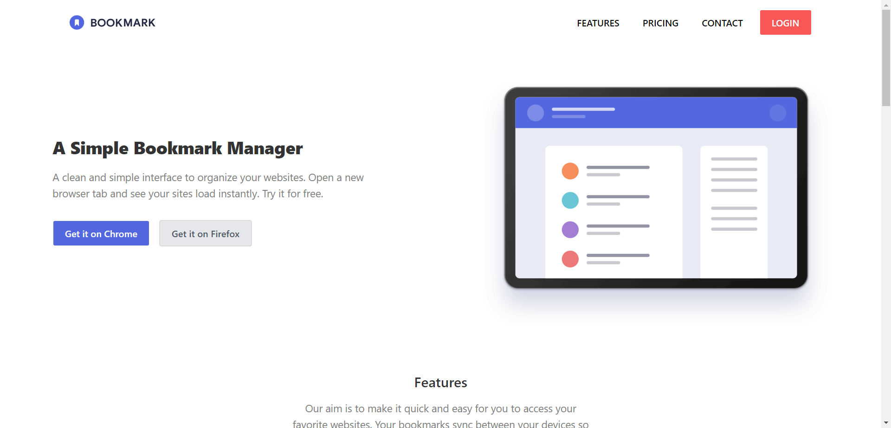
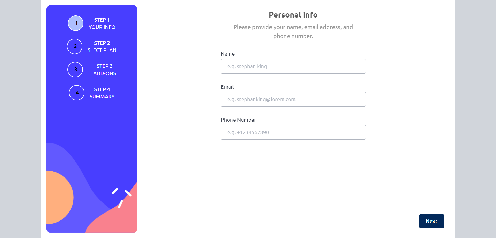
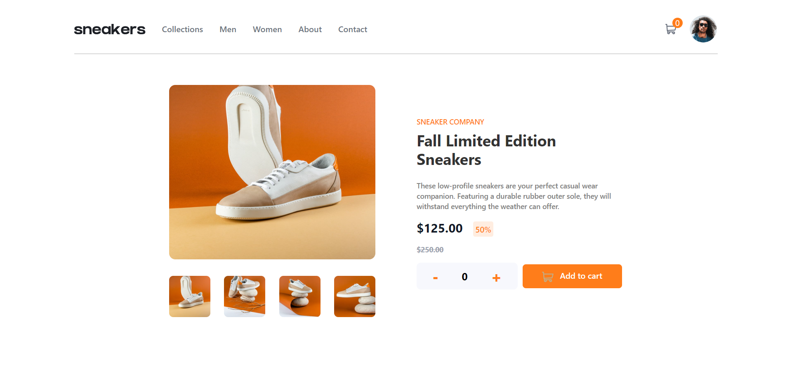
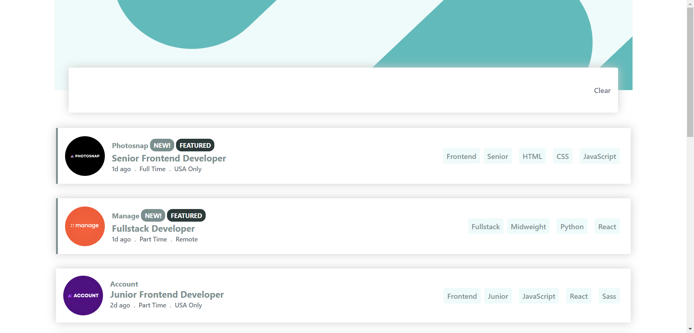

# bittechdeveloper.github.io    

This repository is to build challanging project from multiple online renowned sources like [Free Code Camp](https://www.freecodecamp.org/), [Front End Mentor](https://www.frontendmentor.io/), [Dribbble](https://dribbble.com/) etc.   

Instead of creating a seprate repository for each project, which will create a mess in my github accout, I combined them in a single major repository.   

To distinguish the projects file from each other I named them according to their sources and project names, Specially first few character before `-` or `_` or for their source names like;   

- `fem-*` for projects from [Front End Mentor](https://www.frontendmentor.io/)   
- `fcc-*` for projects from [Free Code Camp](https://www.freecodecamp.org/)
- `Drb-*` for projects from [Dribbble](https://dribbble.com/)

html and javascript file will be separate for each project but css will be same because I mostly used tailwindcss utility classes for styling.   

I built all these project with `vanilla javascript` no framework not even library.   

For configuration I used `Webpack` because for building multiple projects in a single repository `webpack` is best choice. This way I thought it will help me to practise managing mono repo.

Currently, I've built `3` projects from `Front End Mentor`.   

Here they are with their snapshots and links to published sites.   

## `Bookmark Landig Page` from [Front End Mentor](https://www.frontendmentor.io/)   

  

### Main Features:   
Email Validation | Accordion | Interaction | Responsive Layout

[Go to Published site to see full layout and all the functionality ->](https://bittechdeveloper.github.io/projects/views/fem/fem-int-bookmark.html)   

***
***

## `Multi Step Subscription Form` from [Front End Mentor](https://www.frontendmentor.io/)   

### Main Features:   
Dynamic Calculation | Switch mode for duration type | Multi Step | Input Fields checking before Next Step | 
Persistent Storage between Reloads | Interaction | Responsive Layout

[Go to Published site to see full layout and all the functionality ->](https://bittechdeveloper.github.io/projects/views/fem/fem-adv-multi-form.html)  

***
***

## `Ecommerce Product Page` from [Front End Mentor](https://www.frontendmentor.io/)   

   

### Main Features:  
Image Carousal | Interactive Scrolling | LightBox view | Product Counter | Adding to Cart |
Deleting Cart | Dynamic Calculation | Persistent Storage between Reloads | Interaction | Responsive

[Go to Published site to see full layout and all the functionality ->](https://bittechdeveloper.github.io/projects/views/fem/fem-int-ecommerce.html)   

***
***

## `Job Listing Master` from [Front End Mentor](https://www.frontendmentor.io/)   

   

### Main Features:   
Filtering Lists | Dynamic Data Loading through JSON | Interaction | Responsive Layout

[Go to Published site to see full layout and all the functionality ->](https://bittechdeveloper.github.io/projects/views/fem/fem-int-job-listing.html)   

***
***

**These are few but soon I will build other projects too.**